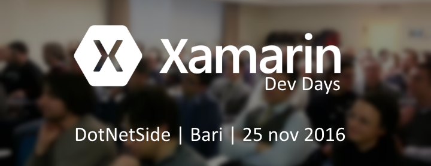

Gli Xamarin Dev Days, in collaborazione con DotNetSide, approdano a Bari, prima tappa del Sud Italia, con una giornata di formazione intensa, tra teoria e pratica, con l'obiettivo di fornire la migliore esperienza di apprendimento a tutti i partecipanti. Durante la mattina esploreremo lo sviluppo mobile con sessioni tecniche per poi approfondire il tutto con un pomeriggio dedicato totalmente al codice.

* [link](https://github.com/DotNetSide/Xamarin-Dev-Days-2016/blob/master/Dev%20Days%203%20-%20Intro%20%26%20to%20Xamarin.pdf "Intro to Xamarin")
* [link](https://github.com/DotNetSide/Xamarin-Dev-Days-2016/blob/master/Dev%20Days%203%20-%20Xamarin%20%26%20Forms.pdf "Xamarin Forms")
* [link](https://github.com/DotNetSide/Xamarin-Dev-Days-2016/blob/master/Dev%20Days%203%20-%20Connected%20%26%20Disconnected%20Apps.pdf "Xamarin + Azure")

Per recuperare le demo e il materiale del lab mostrato durante l'evento potete accedere qui:

* [link](https://github.com/xamarin/dev-days-labs "Xamarin Dev Days")
